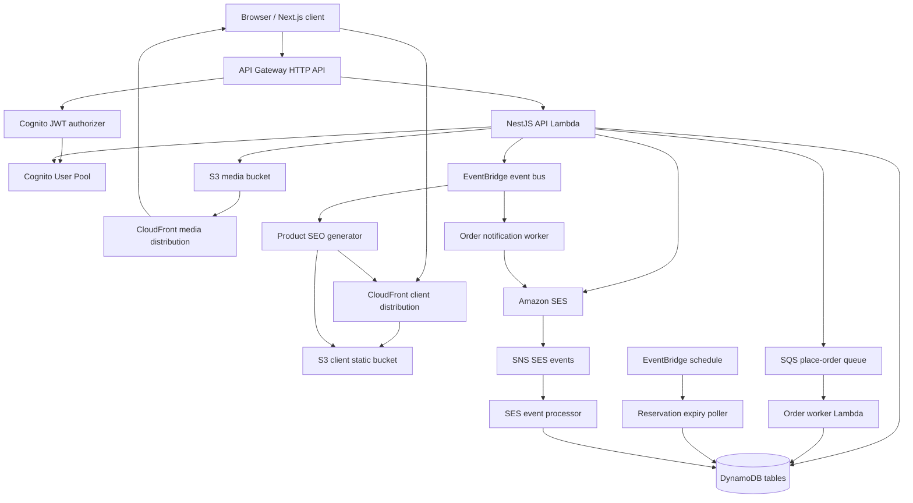
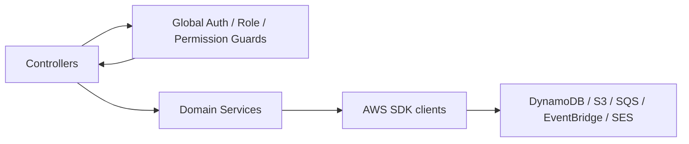
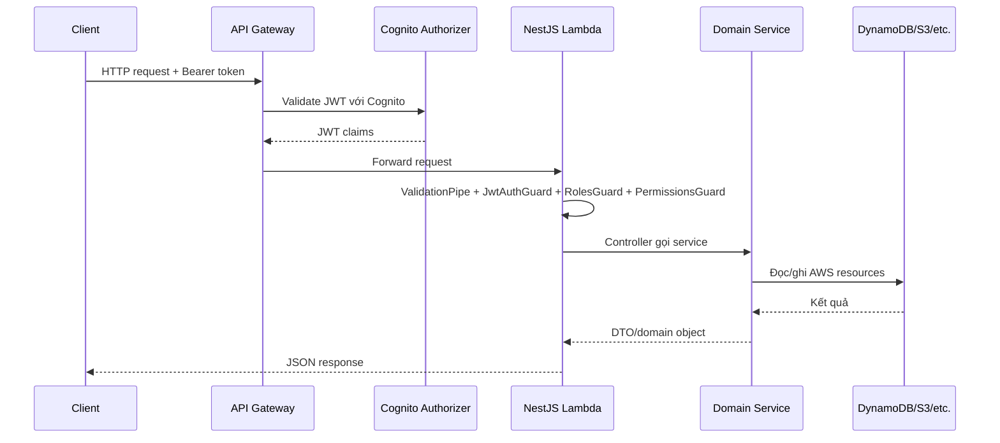
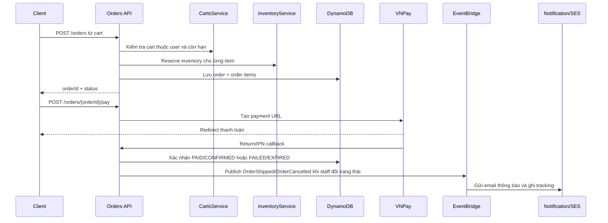

# PhuLoc's E-commerce Server

Server là backend NestJS cho hệ thống e-commerce chạy trên AWS. Repository này cũng chứa CDK infrastructure để dựng API, database, auth, queue, event, email, media storage và static client hosting.

## Công nghệ chính

| Thành phần           | Vai trò                                                                    |
| -------------------- | -------------------------------------------------------------------------- |
| NestJS               | REST API, service layer, validation, guards và Swagger local.              |
| AWS CDK              | Khai báo hạ tầng AWS bằng TypeScript.                                      |
| API Gateway HTTP API | Public API endpoint và JWT authorizer.                                     |
| Lambda               | Chạy NestJS API, workers, Cognito triggers và processors.                  |
| DynamoDB             | Lưu products, categories, carts, orders, inventory, users, email tracking. |
| Cognito              | User pool, Hosted UI, groups/roles, auth triggers.                         |
| SQS                  | Hàng đợi xử lý đặt hàng.                                                   |
| EventBridge          | Domain events cho order/product và scheduled jobs.                         |
| SES/SNS              | Gửi email và nhận delivery/bounce/complaint events.                        |
| S3/CloudFront        | Lưu ảnh media, xử lý ảnh và hosting client static site.                    |
| VNPay                | Tạo URL thanh toán, nhận return/IPN và xử lý trạng thái thanh toán.        |

## Kiến trúc triển khai tổng quan



## Kiến trúc ứng dụng NestJS



`AppModule` gom các module domain:

- `AuthModule`: global guards cho JWT, role và permission.
- `ProductsModule`, `CategoriesModule`: catalog và phát product events khi mutate.
- `InventoryModule`: quản lý tồn kho và reservation.
- `CartsModule`: giỏ hàng theo user.
- `OrdersModule`: tạo đơn, trạng thái đơn, thanh toán VNPay, email tracking của order.
- `UsersModule`: tài khoản quản trị/khách hàng, permission, profile, login audit.
- `UploadModule`: tạo presigned upload cho media.
- `MailModule`: gửi email qua SES và tracking trạng thái gửi.
- `DynamoDbModule`: wrapper DynamoDB DocumentClient.
- `HealthModule`: health check API và kết nối DynamoDB.

## Luồng request API



Các route public chính gồm `GET /health`, `GET /products`, `GET /products/{productId}`, `GET /categories`, `GET /categories/{categoryId}` và VNPay callback/IPN. Các route quản trị, giỏ hàng, đơn hàng, upload và user yêu cầu Cognito JWT; một số route còn yêu cầu role `MANAGER`/`ADMIN` và permission cụ thể.

## Luồng đặt hàng và thanh toán



Hạ tầng cũng có `PlaceOrderWorker` dùng SQS và `ReservationExpiryPoller` chạy theo lịch EventBridge. Poller quét các order đã giữ hàng quá hạn thanh toán để expire reservation và trả tồn kho nếu chưa paid.

## Dữ liệu chính

| Bảng                     | Khóa chính             | Vai trò                                                   |
| ------------------------ | ---------------------- | --------------------------------------------------------- |
| Products                 | `productId`            | Catalog sản phẩm.                                         |
| Categories               | `categoryId`           | Danh mục sản phẩm.                                        |
| Carts                    | `customerId`, `cartId` | Giỏ hàng của khách, có TTL `expiresAt`.                   |
| CartItems                | `cartId`, `productId`  | Dòng sản phẩm trong giỏ.                                  |
| Orders                   | `orderId`              | Đơn hàng, payment status, order status và các GSI để lọc. |
| OrderItems               | `orderId`, `lineId`    | Snapshot dòng sản phẩm của đơn.                           |
| Inventory                | `productId`            | Số lượng available/reserved.                              |
| UserAccounts             | `userId`               | Hồ sơ user, role/permission mở rộng.                      |
| UserLoginAudit           | `userId`, `loginAt`    | Lịch sử đăng nhập, có TTL.                                |
| EmailTracking            | `emailId`              | Trạng thái email SES theo context/recipient.              |
| EventConsumerIdempotency | `idempotencyKey`       | Chống xử lý trùng event, có TTL.                          |

## CDK stacks

- `ServerStack`: tạo DynamoDB, Cognito, API Lambda, API Gateway, SQS, EventBridge, SES/SNS, media S3/CloudFront, workers và outputs cần cho client.
- `ClientDevStack`: deploy `client/out` lên S3, phân phối qua CloudFront, rewrite static routes, tạo product SEO pages khi nhận product events.

## Chạy local

`npm run start:dev` chạy NestJS local nhưng vẫn gọi AWS services thật bằng credentials hiện tại. Swagger local ở <http://localhost:8000/api>.

```bash
npm install
npm run start:dev
```

Các lệnh hữu ích:

```bash
npm run build
npm run format
npm run format:check
npm run seed:catalog
npm run seed:users
npm run seed:all
npm run simulate:oversell
npm run test:notification-retry
npm run seo:backfill:products
```

## Deploy AWS

1. Cấu hình AWS CLI credentials cho account và region cần dùng.
2. Copy `.env.example` thành `.env.dev` và điền account ID, tên bucket/domain/Cognito, VNPay, SES và các giá trị hạ tầng.
3. Cài dependencies: `npm install`.
4. Validate template: `npm run infra:synth`.
5. Bootstrap CDK một lần cho account/region:

```bash
npm run infra:bootstrap -- aws://<account-id>/ap-southeast-1
```

6. Deploy server stack:

```bash
npm run infra:deploy
```

7. Deploy client stack sau khi server outputs đã được tạo:

```bash
npm run infra:deploy:client
```

Các lệnh CDK thường dùng:

```bash
npm run infra:synth
npm run infra:synth:client
npm run infra:deploy
npm run infra:deploy:client
npm run infra:destroy
```

Lambda functions dùng IAM execution roles. Không đặt AWS access keys trực tiếp trong `.env.dev`.
